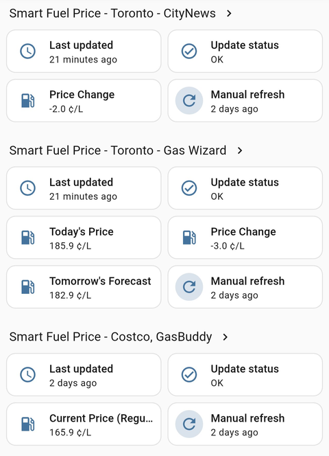
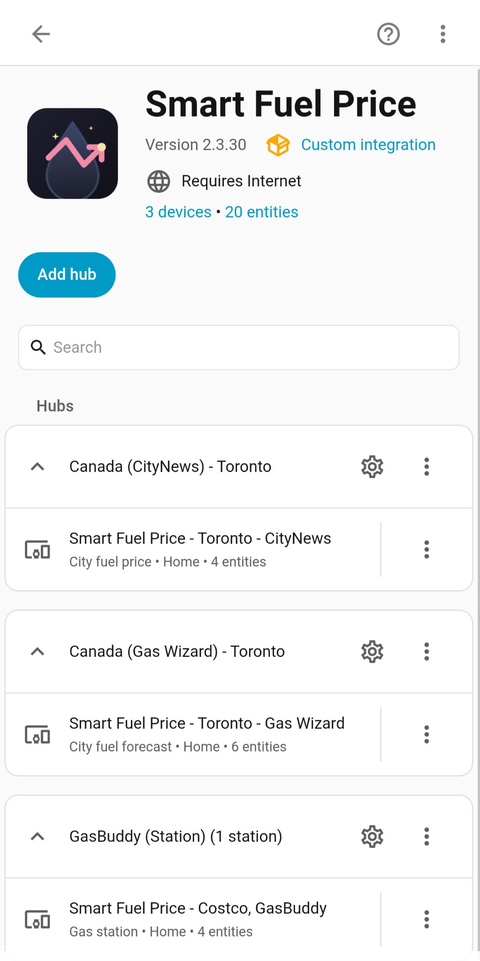
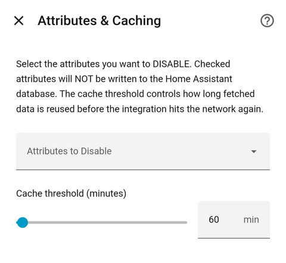

# Smart Fuel Price Integration for Home Assistant


A Home Assistant custom integration that tracks fuel prices for Canadian cities — daily price forecasts (Gas Wizard, CityNews) and live per-station prices (GasBuddy, anywhere it has data).

---

## Screenshots



| Integration page | Options flow |
|---|---|
|  |  |

---

## Features

- **Multi-Provider Architecture**: Supports `AffordableEnergy` (Gas Wizard), `CityNews Canada`, and `GasBuddy` (per-station).
- **UI Configuration (Config Flow)**: A two-step setup — pick a provider, then fill in just the details that provider needs (a city, or GasBuddy station IDs and fuel grades).
- **Multi-Station, Multi-Grade GasBuddy Tracking**: Track several stations at once, each with one or more fuel grades (Regular, Midgrade, Premium, Diesel) — one HA device per station, one sensor per grade.
- **Automatic Area Assignment**: New devices are created with a suggested Area matching their city, so Home Assistant sets this up for you on first install.
- **Dynamic Attribute Filtering (Options Flow)**: Enable or disable specific state attributes via UI settings without modifying code.
- **YAML Migration Support**: Automatically migrates legacy `configuration.yaml` definitions into UI Config Entries seamlessly.

---

## Installation

### Method 1: HACS (Recommended)

1. Open **HACS** in your Home Assistant sidebar.
2. Search for `Smart Fuel Price` under **Integrations**.
3. Click **Download**.
4. Restart Home Assistant Core.

### Method 2: Manual Installation

1. Download the `smart_fuel_price.zip` archive from the latest [Release Page](https://github.com/meokey/smart-fuel-price/releases).
2. Extract the `smart_fuel_price` folder into your Home Assistant directory:
```text
   custom_components/smart_fuel_price/
```
3. Restart Home Assistant Core.

---

## Configuration

After installation, configure your sensors through the Home Assistant UI:

1. Go to **Settings** -> **Devices & Services**.
2. Click **Add Integration** in the bottom right corner.
3. Search for **Smart Fuel Price**.
4. Select your desired **Provider**, then fill in the next step's details
   (a **City**, or GasBuddy **Station ID(s)** and **fuel grade(s)**).
5. Click **Submit**.

> **Note**: You can add multiple instances of this integration for different cities, providers, or station groups!

### Managing Sensor Attributes (Options Flow)

To customize which attributes are sent to your database:

1. Go to **Settings** -> **Devices & Services**.
2. Find your **Smart Fuel Price** integration entry.
3. Click **Configure** (the gear icon).
4. Check the attributes you wish to **disable** and click **Submit**.

### Gas Wizard entities

A Gas Wizard entry creates three sensor entities on one device:

- **Price Change** -- tomorrow's forecast minus today's price (in ¢/L).
- **Today's Price** -- today's known average price. Reported whenever the
  site lists today, even while tomorrow's forecast isn't published yet.
- **Tomorrow's Forecast** -- the predicted average price; its
  `effective_date_str` attribute names the exact forecast date
  (e.g. "Wednesday Oct 7, 2026"). Shows `unknown` until the site publishes
  the forecast (usually by the evening).

### Data caching & refresh threshold

Each entry keeps a local cache of the last fetched data plus its timestamp
(persisted in `.storage`, so it survives restarts). The same Options screen
lets you set a **cache threshold** per entry:

- If the last fetch is *newer* than the threshold, the sensor reuses the
  cached data without hitting the network.
- Presets: **240 min** for forecast providers (Gas Wizard, CityNews),
  **30 min** for GasBuddy. Adjustable from 5 to 1440 minutes.

When a fetch fails but cached data exists, live-price providers (GasBuddy)
keep showing the last known value marked with a `stale: True` attribute
instead of going `unknown` -- useful during rate-limiting episodes.
Forecast providers never serve stale forecasts; they show `unknown` until
fresh data arrives.

Each device also gets a **Manual refresh** button entity for a manual,
cache-bypassing fetch at any time, a **Last updated** timestamp sensor
showing when the device's data was last successfully fetched -- covering
both automatic polls and manual refreshes -- and an **Update status**
sensor (`OK` / `Rate limited` / `Failed`) reporting the outcome of the last
fetch attempt. (The button's own timestamp only records manual presses,
which is standard Home Assistant button behavior.)

Rate limiting (HTTP 429, or 403 where a source uses it for bot-protection)
is tracked separately from generic failures. When *automatic* polls get
rate-limited, the Update status sensor carries a `suggestion` attribute
advising you to raise the cache threshold for that entry (Options) -- a
manual press that hits the limit needs no such hint.

The device info card shows the device type (`Gas station` vs `City fuel
forecast` / `City fuel price`) and a link to the source page (the GasBuddy
station page, the Gas Wizard city page, or the CityNews article that last
parsed), so the numbers can be checked against the source in one tap. The
station's street address, city and province ride along as attributes on the
price sensor.

### Suggested dashboard layout

For a Gas Wizard device, a vertical stack keeps the three related sensors
together, with the button card below for a manual refresh:

```yaml
type: vertical-stack
cards:
  - type: entities
    title: Toronto — Gas Wizard
    entities:
      - sensor.smart_fuel_price_toronto_gas_wizard_today_s_price
      - sensor.smart_fuel_price_toronto_gas_wizard_tomorrow_s_forecast
      - sensor.smart_fuel_price_toronto_gas_wizard
  - type: button
    entity: button.smart_fuel_price_toronto_gas_wizard_refresh_data
    name: Manual refresh
```

(Adjust the entity IDs to match your own device/city.)

---

## Supported Providers & Cities

| Provider Identifier | Target Region | Dynamic Cities Supported |
| :--- | :--- | :--- |
| `affordableenergy_ca` | Canada (Nationwide) | `toronto`, `mississauga`, `vancouver`, `calgary`, `ottawa`, `montreal` -- all confirmed live |
| `citynews_ca` | Canada Major Cities | `toronto`, `ottawa`, `kitchener` (`calgary` currently unsupported -- tracked in [#30](https://github.com/meokey/smart-fuel-price/issues/30)) |
| `gasbuddy_ca` | Any station, anywhere GasBuddy has data (GTA included) | N/A -- configured by station ID, not a fixed city list; see [GasBuddy section](#gasbuddy-per-station) below |

> **Note:** Gas Wizard publishes tomorrow's forecast on its own schedule (usually by the evening).
> Until then, its sensors show *unknown* rather than a stale value.

---

## Sensor Naming & Organization

Devices and entities are named **"Smart Fuel Price - `<City>` - `<Provider>`"** (or, for GasBuddy, **"Smart Fuel Price - `<City>` - GasBuddy (`<Station Name>`)"**), so everything this integration creates sorts and groups together in the Home Assistant UI.

Each device is also created with a **suggested Area** matching its city -- Home Assistant will automatically create that Area (if it doesn't already exist) and assign the device to it the first time it's set up. You're free to change this afterward; it's a one-time suggestion, not an enforced setting.

---

## Sensors & Attributes

Every device carries three housekeeping entities plus its price sensors:

| Entity | What it tells you |
|---|---|
| **Last updated** | Timestamp of the last *successful* data fetch (automatic or manual). This is the true data-freshness signal. |
| **Update status** | `OK` / `Rate limited` / `Failed` for the last fetch attempt. When automatic polls are rate-limited it also carries a `suggestion` attribute advising a higher cache threshold. |
| **Manual refresh** (button) | Cache-bypassing fetch on demand. |

Key attributes on the price sensors (all toggleable via the Options flow):

| Sensor | Notable attributes |
|---|---|
| Gas Wizard / CityNews price sensors | `current_price`, `tomorrow_price`, `effective_date_str` (the exact forecast date, e.g. "Wednesday Oct 7, 2026"), `city` |
| GasBuddy price sensor (per grade) | `station_name`, `station_id`, `fuel_grade`, `phone`, `address`, `city`, `province_or_state`, `latitude`, `longitude`, `last_reported_str`, `stale` (true while serving cached data during an outage) |

---

## GasBuddy (per-station)

Unlike the other providers, GasBuddy tracks specific gas stations you
choose, not a city average — there's no forecast, just live reported
prices, so its sensors show the **current price** rather than a price
*change*.

**Finding a station ID:**
1. Open https://www.gasbuddy.com/gaspricemap
2. Click a station's price bubble, then click through to its page
3. The station ID is the number at the end of the URL:
   `https://www.gasbuddy.com/station/205748` → ID is `205748`

When configuring, select **GasBuddy (Station)** as the provider, enter
one or more station IDs (comma-separated, e.g. `205748, 123456`), and
pick one or more fuel grades to track (Regular, Midgrade, Premium,
Diesel). One sensor is created per (station, grade) combination, and all
grades for the same station share a single device.

GasBuddy's crowd-sourced prices can change more often than a forecast
updates once a day, so these sensors refresh every 30 minutes rather
than the 4-hour default used by the forecast providers.

Note: GasBuddy reports Canadian prices in cents per litre (e.g. `168.9`
¢/L). The value is shown as-is with the `¢/L` unit, consistent
with the other sensors and with how prices are quoted on Canadian pumps.

*Station price data is retrieved via GasBuddy's official GraphQL API.
Thanks to [firstof9/py-gasbuddy](https://github.com/firstof9/py-gasbuddy)
and [firstof9/ha-gasbuddy](https://github.com/firstof9/ha-gasbuddy)
(both MIT) for reverse-engineering the API and the CSRF-token flow —
earlier versions used an endpoint documented by the
[Red5d/ha-gasbuddy](https://github.com/Red5d/ha-gasbuddy) project, thanks
to Red5d and contributors for that groundwork.*

---

## Troubleshooting

**A sensor shows "Unknown".**
Check the device's **Last updated** and **Update status** sensors first.
Right after a restart, the first fetch can take one poll cycle; the
persisted cache (`.storage`) normally covers the gap. Forecast providers
show `unknown` (never stale data) until the source publishes fresh
numbers — for Gas Wizard's tomorrow forecast that is usually by the
evening.

**Update status says "Rate limited".**
The source is throttling requests. The sensor keeps working from cache
(GasBuddy marks it `stale: True`). Follow the `suggestion` attribute:
raise the **cache threshold** for that entry under Configure (gear icon).

**The entity list says "updated X minutes ago" but the data looks old.**
That text comes from Home Assistant's `last_changed`, which resets
whenever the entity is re-created (HA restart, options change) — it is
not a data-freshness signal. Trust the **Last updated** sensor instead.

**GasBuddy flips between OK and "Rate limited".**
GasBuddy occasionally challenges automated requests (Cloudflare). The
integration retries with a fresh session token; brief flapping during
such episodes is expected and resolves on its own.

Still stuck? File a bug report — see [Contributing](#contributing).

---

## Contributing

Issues and pull requests are welcome!

- **Bug reports / feature requests:** use the [issue templates](https://github.com/meokey/smart-fuel-price/issues/new/choose) — they ask for the integration version, provider, and logs up front. One honest question in each template: *do you plan to work on it yourself?* Answering "just suggesting" is perfectly fine; it just keeps two people from building the same thing.
- **Questions that aren't bugs:** open a [Discussion](https://github.com/meokey/smart-fuel-price/discussions).
- **Pull requests:** small, focused PRs with a green test run (`pytest`) are the fastest to review.

Please note the data sources are read-only — the integration only ever
*fetches* prices; it never submits anything back to a source.

---

## Changelog

See the [Releases page](https://github.com/meokey/smart-fuel-price/releases) for the changelog.

---

## Development

### Running tests

```bash
pip install -r requirements-test.txt
pytest            # offline tests (default)
pytest -m live    # live smoke tests against real provider sites
```

`pytest.ini` excludes live tests by default; known-failing live checks are
marked `xfail` rather than skipped.

## License

Distributed under the MIT License. See `LICENSE` for more information.
